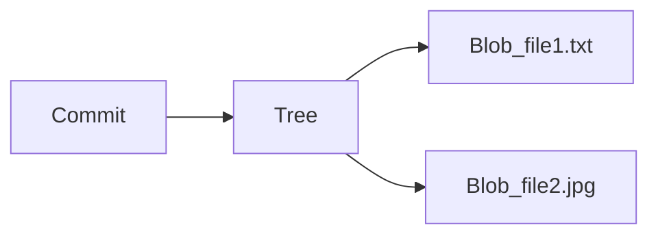
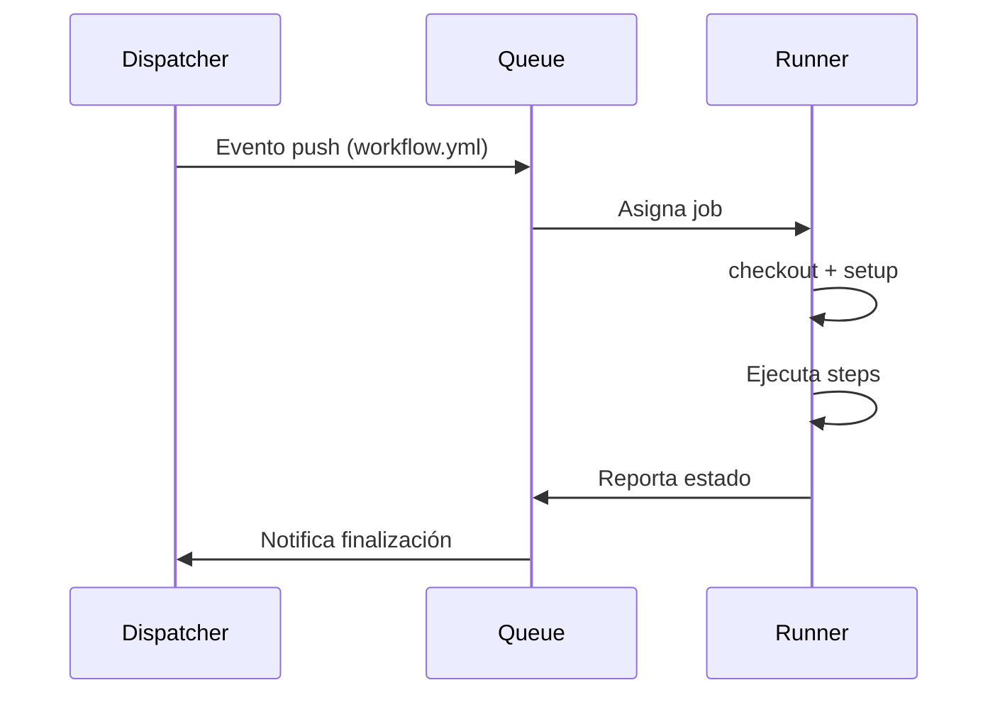
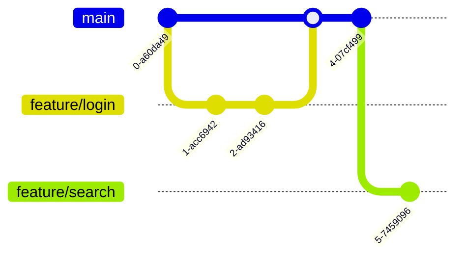

# Git y GitHub: Introducción, Fundamentos y Arquitectura

## 1. Introducción

### ¿Qué es Git?
Git es un **sistema de control de versiones distribuido** (DVCS) creado por Linus Torvalds en 2005. Permite:
- Registrar cambios en archivos (historial completo)
- Trabajar en equipo de forma coordinada
- Revertir a versiones anteriores
- Ramificar proyectos sin afectar la línea principal

### ¿Qué es GitHub?
GitHub es una plataforma de **alojamiento y colaboración** basada en Git que ofrece:
- Repositorios remotos públicos/privados
- Herramientas para CI/CD, gestión de proyectos y documentación
- Comunidad open source (forking, pull requests)
- Integración con otras herramientas (Slack, Docker, AWS)

---

## 2. Diferencias con otros VCS

| Característica       | Git (Distribuido)       | SVN (Centralizado)      | Mercurial (Distribuido) |
|----------------------|-------------------------|-------------------------|-------------------------|
| **Modelo**           | Distribuido             | Centralizado            | Distribuido             |
| **Velocidad**        | Muy rápido             | Lento en grandes repos  | Rápido                  |
| **Ramas**           | Ramificación ligera    | Ramas pesadas          | Similar a Git           |
| **Curva de aprendizaje** | Alta               | Moderada               | Baja                    |
| **Comunidad**       | Dominante              | En declive             | Nicho                   |

**Key Insight**:  
Git sobresale en:
- Operaciones locales (commits sin conexión)
- Merging eficiente
- Flexibilidad con `rebase`, `stash`, etc.

---

## 3. Ventajas del modelo distribuido

1. **Trabajo offline**: Commit local sin servidor central
2. **Redundancia**: Cada clon es un backup completo
3. **Flujos flexibles**: Múltiples estrategias (Git Flow, GitHub Flow)
4. **Seguridad**: Hash SHA-1 para integridad de datos
5. **Escalabilidad**: Manejo eficiente de grandes repos (ej. Linux kernel)

---

## 4. Arquitectura de GitHub

```mermaid
graph TD
    A[Cliente Git] -->|HTTP/SSH| B[GitHub Servers]
    B --> C[Load Balancers]
    C --> D[Frontend]
    C --> E[API]
    D --> F[Git Storage]
    E --> F
    F --> G[Database]
    F --> H[Redis Cache]
    F --> I[Storage Backend (S3)]
```
### Componentes clave

#### Git Storage
- **Función**: Almacenamiento eficiente de objetos Git mediante:
      - **Blobs**: Contenido binario de archivos
      - **Trees**: Estructuras de directorios
      - **Commits**: Instantáneas con metadatos (autor, fecha, parent)
    - **Técnicas**:
      - Compresión con zlib
      - Empaquetado en archivos `.pack` (delta compression)
      - Referencias mediante hashes SHA-1


#### GitHub Actions
- Ejecución en runners efímeros (VM/containers)
- Componentes:
  - Workflow dispatcher
  - Job queuer
  - Artifact storage
- Aislamiento mediante namespaces Linux

#### Búsqueda (Elasticsearch)
- Cluster distribuido con:
  - Nodos master (gestión)
  - Nodos data (índices)
  - Nodos ingest (transformación)
- Índices especializados para:
  - Código (analysis por lenguaje)
  - Metadata de commits

#### Renderizado Markdown
- Proceso en 4 etapas:
  1. Parseo GFM (GitHub Flavored Markdown)
  2. Sanitización HTML
  3. Transformación a AST
  4. Renderizado final
- Extensiones personalizadas:
  - Emoji shortcuts
  - Mentions (@user)
  - Task lists

---

## 5. Casos de uso y flujos de trabajo

### Escenarios comunes
- **Open Source**: Fork + Pull Request
- **Enterprise**: Branch protection + CODEOWNERS
- **Docs-as-Code**: Wikis + GitHub Pages

### Flujos estándar
1. **GitHub Flow**:
   - Ramas feature desde main
   - PR + revisión
   - Merge tras aprobación


2. **Git Flow**:
   - Ramas develop y release
   - Hotfixes paralelos
   - Versionado semántico

---

## 6. Buenas prácticas (Bonus)
- **Commits**:
  - Mensajes convencionales (Angular style)
  - Atomicidad (un cambio por commit)
- **Seguridad**:
  - 2FA obligatorio
  - Dependabot para updates
- **Performance**:
  - .gitignore completo
  - Shallow clones para CI
  - GC periódico

Siguiente: [Instalación y Configuración](2-instalacion-config.md)  
