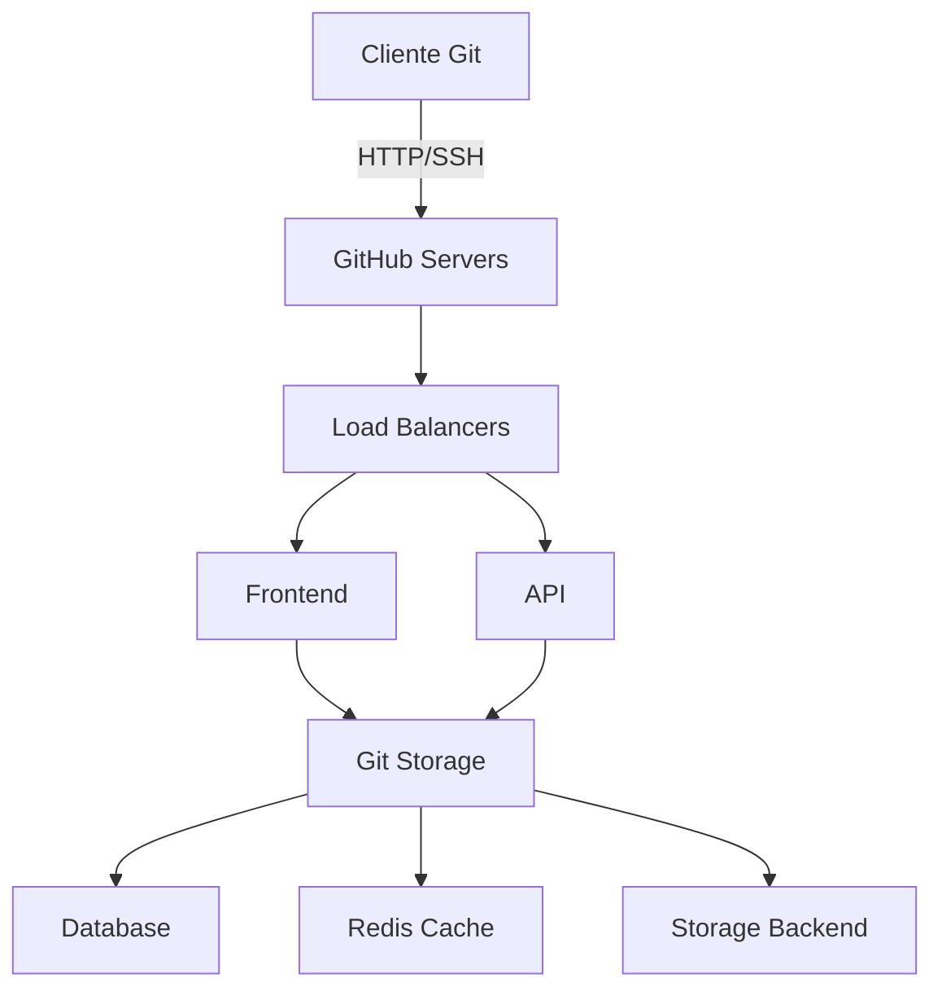
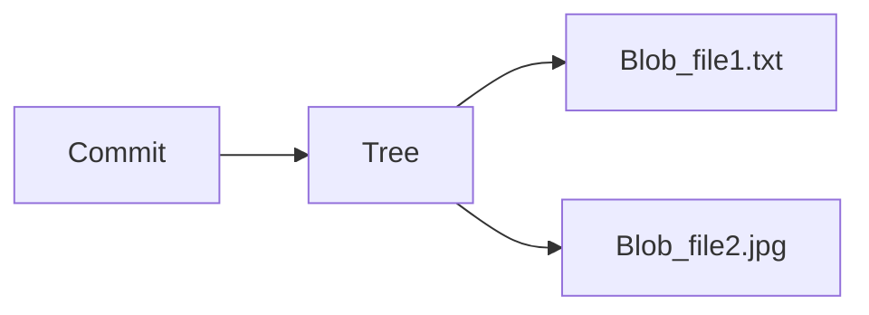
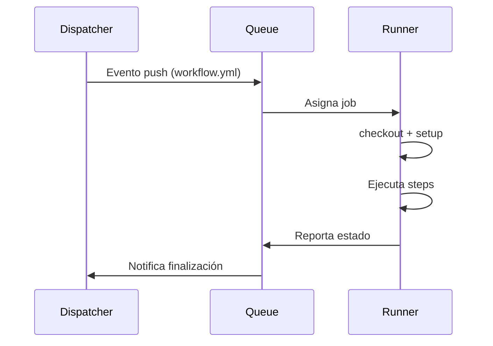
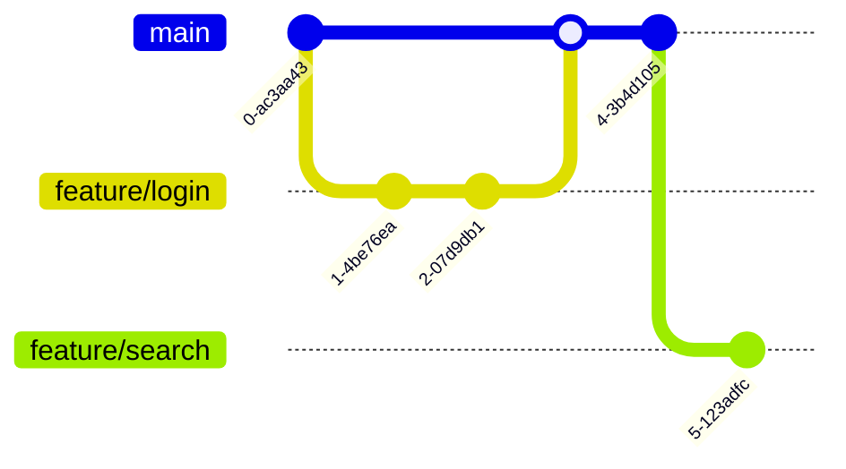

# Git y GitHub: Introducción, Fundamentos y Arquitectura

## 1. Introducción

### ¿Qué es Git?
Git es un **sistema de control de versiones distribuido** (DVCS) creado por Linus Torvalds en 2005. Permite:
- Registrar cambios en archivos (historial completo)
- Trabajar en equipo de forma coordinada
- Revertir a versiones anteriores
- Ramificar proyectos sin afectar la línea principal

### ¿Qué es GitHub?
GitHub es una plataforma de **alojamiento y colaboración** basada en Git que ofrece:
- Repositorios remotos públicos/privados
- Herramientas para CI/CD, gestión de proyectos y documentación
- Comunidad open source (forking, pull requests)
- Integración con otras herramientas (Slack, Docker, AWS)

---

## 2. Diferencias con otros VCS

| Característica       | Git (Distribuido)       | SVN (Centralizado)      | Mercurial (Distribuido) |
|----------------------|-------------------------|-------------------------|-------------------------|
| **Modelo**           | Distribuido             | Centralizado            | Distribuido             |
| **Velocidad**        | Muy rápido             | Lento en grandes repos  | Rápido                  |
| **Ramas**           | Ramificación ligera    | Ramas pesadas          | Similar a Git           |
| **Curva de aprendizaje** | Alta               | Moderada               | Baja                    |
| **Comunidad**       | Dominante              | En declive             | Nicho                   |

**Key Insight**:  
Git sobresale en:
- Operaciones locales (commits sin conexión)
- Merging eficiente
- Flexibilidad con `rebase`, `stash`, etc.

---

## 3. Ventajas del modelo distribuido

1. **Trabajo offline**: Commit local sin servidor central
2. **Redundancia**: Cada clon es un backup completo
3. **Flujos flexibles**: Múltiples estrategias (Git Flow, GitHub Flow)
4. **Seguridad**: Hash SHA-1 para integridad de datos
5. **Escalabilidad**: Manejo eficiente de grandes repos (ej. Linux kernel)

---

## 4. Arquitectura de GitHub

```mermaid
graph TD
    A[Cliente Git] -->|HTTP/SSH| B[GitHub Servers]
    B --> C[Load Balancers]
    C --> D[Frontend]
    C --> E[API]
    D --> F[Git Storage]
    E --> F
    F --> G[Database]
    F --> H[Redis Cache]
    F --> I[Storage Backend]
```
### Componentes clave

#### Git Storage
- **Función**: Almacenamiento eficiente de objetos Git mediante:
      - **Blobs**: Contenido binario de archivos
      - **Trees**: Estructuras de directorios
      - **Commits**: Instantáneas con metadatos (autor, fecha, parent)
    - **Técnicas**:
      - Compresión con zlib
      - Empaquetado en archivos `.pack` (delta compression)
      - Referencias mediante hashes SHA-1

```mermaid
graph LR
    A[Commit] --> B[Tree]
    B --> C[Blob_file1.txt]
    B --> D[Blob_file2.jpg]
```
#### GitHub Actions
- Ejecución en runners efímeros (VM/containers)
- Componentes:
  - Workflow dispatcher
  - Job queuer
  - Artifact storage
- Aislamiento mediante namespaces Linux

```mermaid
sequenceDiagram
    participant D as Dispatcher
    participant Q as Queue
    participant R as Runner
    D->>Q: Evento push (workflow.yml)
    Q->>R: Asigna job
    R->>R: checkout + setup
    R->>R: Ejecuta steps
    R->>Q: Reporta estado
    Q->>D: Notifica finalización
```
#### Búsqueda (Elasticsearch)
- Cluster distribuido con:
  - Nodos master (gestión)
  - Nodos data (índices)
  - Nodos ingest (transformación)
- Índices especializados para:
  - Código (analysis por lenguaje)
  - Metadata de commits

#### Renderizado Markdown
- Proceso en 4 etapas:
  1. Parseo GFM (GitHub Flavored Markdown)
  2. Sanitización HTML
  3. Transformación a AST
  4. Renderizado final
- Extensiones personalizadas:
  - Emoji shortcuts
  - Mentions (@user)
  - Task lists

---

## 5. Casos de uso y flujos de trabajo

### Escenarios comunes
- **Open Source**: Fork + Pull Request
- **Enterprise**: Branch protection + CODEOWNERS
- **Docs-as-Code**: Wikis + GitHub Pages

### Flujos estándar
1. **GitHub Flow**:
   - Ramas feature desde main
   - PR + revisión
   - Merge tras aprobación

```mermaid
gitGraph
    commit
    branch feature/login
    checkout feature/login
    commit
    commit
    checkout main
    merge feature/login
    commit
    branch feature/search
    checkout feature/search
    commit
```
2. **Git Flow**:
   - Ramas develop y release
   - Hotfixes paralelos
   - Versionado semántico

---

## 6. Buenas prácticas (Bonus)
- **Commits**:
  - Mensajes convencionales (Angular style)
  - Atomicidad (un cambio por commit)
- **Seguridad**:
  - 2FA obligatorio
  - Dependabot para updates
- **Performance**:
  - .gitignore completo
  - Shallow clones para CI
  - GC periódico

Siguiente: [Instalación y Configuración](2-instalacion-config.md)  

---

## Ejercicios

**1.1** — Explica con tus propias palabras la diferencia entre Git y GitHub. ¿Pueden existir el uno sin el otro?

**1.2** — ¿Por qué Git usa hashes SHA-1 para identificar commits en lugar de números correlativos (v1, v2, v3...)? ¿Qué ventaja aporta en un sistema distribuido?

**1.3** — Imagina que guardas versiones de tu proyecto renombrando carpetas: `proyecto_v1/`, `proyecto_v2_final/`, `proyecto_v2_final_DEFINITIVO/`. Enumera al menos 3 problemas concretos que este método tiene y que Git resuelve.

**1.4** — ¿Qué diferencia hay entre un repositorio **centralizado** (SVN) y uno **distribuido** (Git) en caso de que el servidor principal se caiga?

Soluciones

---

**1.1**

**Git** es el sistema de control de versiones: el programa que registra cambios, gestiona ramas y permite viajar en el historial — todo ello en local, sin conexión.  
**GitHub** es una plataforma web que aloja repositorios Git remotos y añade herramientas de colaboración (PRs, Issues, Actions, Pages…).

Pueden existir de forma independiente: puedes usar Git sin GitHub (con otro remoto o solo local) y GitHub sin Git no tendría sentido.

---

**1.2**

El hash SHA-1 se calcula a partir del contenido del commit (árbol de ficheros, mensaje, autor, fecha, hash del padre). Esto significa que dos desarrolladores que partan del mismo estado y hagan el mismo commit obtendrán **el mismo hash**, sin necesidad de coordinarse con ningún servidor central. Con números correlativos habría colisiones.

---

**1.3**

Problemas del método de carpetas:
1. **Sin historial de cambios internos**: sabes qué versión es, pero no _qué línea cambió_ entre una y otra.
2. **Sin ramas**: no puedes trabajar en dos funcionalidades a la vez sin duplicar todo el proyecto.
3. **Sin colaboración**: si dos personas modifican el mismo archivo en sus copias, reconciliar los cambios es manual.
4. **Espacio**: cada versión duplica el proyecto entero aunque solo hayan cambiado 3 líneas.

---

**1.4**

Con SVN, si el servidor cae **nadie puede hacer commits ni ver el historial** — todo está centralizado.  
Con Git, cada desarrollador tiene una copia completa del repositorio, por lo que puede seguir trabajando (commits locales, explorar historial) aunque el servidor esté caído. Solo las operaciones de sincronización (push/pull) requieren conexión.

