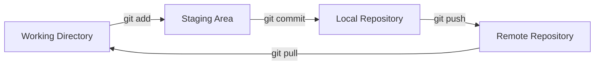

# 3. Comandos Básicos de Git

A continuación se detallan los comandos esenciales para trabajar con Git, desde la creación de repositorios hasta el manejo de commits y el historial de cambios.

## 1. Crear y Clonar Repositorios

### 1.1. git init – Inicializar un Repositorio Local

Crea un nuevo repositorio Git en un directorio local:

```sh
mkdir mi-proyecto
cd mi-proyecto
git init
```

Se crea una carpeta oculta .git que almacena toda la información del repositorio.

### 1.2. git clone – Clonar un Repositorio Remoto

Descarga un repositorio existente desde un servidor remoto (GitHub, GitLab, etc.):

```sh
git clone https://github.com/usuario/repositorio.git
```

Opciones útiles:

```sh
git clone --branch desarrollo https://github.com/usuario/repositorio.git  # Clona una rama específica
git clone --depth 1 https://github.com/usuario/repositorio.git           # Clona solo el último commit (historial superficial)
```

## 2. Estado del Repositorio

### 2.1. git status – Ver el Estado Actual

Muestra archivos modificados, eliminados o sin seguimiento:

```sh
git status
```

Ejemplo de salida:

```
On branch main
Changes not staged for commit:
  (use "git add <file>..." to update what will be committed)
  modified:   README.md
Untracked files:
  (use "git add <file>..." to include in what will be committed)
  nuevo-archivo.txt
```

### 2.2. git diff – Ver Cambios No Preparados

Compara cambios en archivos que aún no se han agregado al staging area:

```sh
git diff
```

Para ver cambios en archivos ya preparados (git add):

```sh
git diff --staged
```

## 3. Agregar Cambios al Staging Area

### 3.1. git add – Preparar Cambios para Commit

Agregar un archivo específico:

```sh
git add archivo.txt
```

Agregar todos los archivos modificados/eliminados:

```sh
git add .           # Agrega todo en el directorio actual (incluye nuevos archivos)
git add -u          # Solo archivos rastreados (modificaciones/eliminaciones)
git add -A          # Todos los cambios (equivalente a `git add .` + `git add -u`)
```

## 4. Confirmar Cambios (git commit)

### 4.1. Commit Básico

Guarda los cambios preparados (git add) en el historial:

```sh
git commit -m "Mensaje descriptivo del cambio"
```

### 4.2. Commit Múltiple (Varios add en un Commit)

Si olvidaste agregar un archivo antes de hacer commit:

```sh
git add archivo-faltante.txt
git commit --amend -m "Nuevo mensaje del commit"
```

¡Cuidado! --amend modifica el último commit (no usar en commits ya subidos al repositorio remoto).

### 4.3. Saltar el Staging Area

Si quieres hacer commit de todos los archivos rastreados sin usar git add:

```sh
git commit -a -m "Mensaje"
```

(Equivalente a git add -u + git commit -m).

## 5. Historial de Cambios

### 5.1. git log – Ver el Historial de Commits

Muestra todos los commits en orden cronológico inverso:

```sh
git log
```

Opciones útiles:

| Comando | Descripción |
|--------|-------------|
| git log --oneline | Muestra commits en una sola línea. |
| git log --graph | Muestra ramas y merges en formato gráfico. |
| git log -p | Muestra diferencias (diffs) en cada commit. |
| git log --since="1 week" | Filtra commits recientes. |

### 5.2. git show – Detalles de un Commit

Muestra cambios específicos de un commit (hash o HEAD):

```sh
git show abc123   # Muestra el commit con hash `abc123`
git show HEAD     # Muestra el último commit
```

## 6. Buenas Prácticas en Mensajes de Commit

### 6.1. Convencional Commits

Estructura recomendada para mensajes claros y estandarizados:

```
<tipo>[ámbito opcional]: <descripción>

[Cuerpo opcional]

[Pie de página opcional]
```

Ejemplos:

```
feat: agregar autenticación con JWT
fix(api): corregir error 500 en endpoint /users
docs: actualizar README.md
```

### 6.2. Tipos de Commits Más Comunes

| Tipo | Descripción |
|------|-------------|
| feat | Nueva funcionalidad. |
| fix | Corrección de errores. |
| docs | Cambios en documentación. |
| style | Formato (espacios, comas, etc.), sin cambios en lógica. |
| refactor | Reestructuración de código sin corregir errores. |
| test | Añadir o modificar pruebas. |

## 7. Diagrama de Flujo Básico de Git



## 8. Resumen de Comandos

| Comando | Uso |
|--------|-----|
| git init | Inicializa un repositorio local. |
| git clone <url> | Clona un repositorio remoto. |
| git status | Muestra el estado del repositorio. |
| git add <archivo> | Prepara cambios para commit. |
| git commit -m "msg" | Guarda cambios en el historial. |
| git log | Muestra el historial de commits. |
| git show <hash> | Detalles de un commit específico. |


---

Siguiente: [Ramas y Fusiones](4-ramas.md)  
