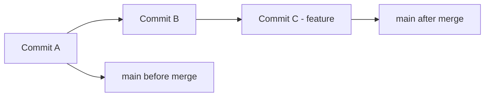
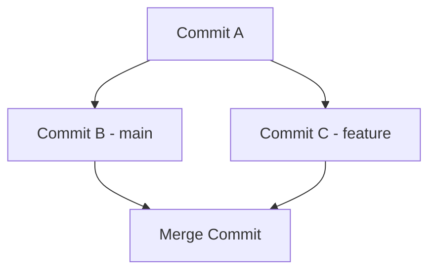

# 4. Ramas y Fusiones

Las ramas son una de las características más poderosas de Git, permitiendo el desarrollo paralelo de funcionalidades sin interferir con el código principal. En este capítulo aprenderás todo sobre la creación, gestión y fusión de ramas.

## 1. Fundamentos de las Ramas

### 1.1. ¿Qué son las Ramas?
Una rama (branch) en Git es simplemente un puntero móvil a un commit específico. Cuando creas una nueva rama, Git crea un nuevo puntero al commit actual, permitiendo que el desarrollo diverge en direcciones diferentes.

### 1.2. ¿Por qué usar Ramas?
Las ramas permiten:
- **Desarrollo paralelo**: Múltiples desarrolladores trabajando simultáneamente
- **Aislamiento de funcionalidades**: Cada feature en su propia rama
- **Experimentación segura**: Probar ideas sin afectar el código principal
- **Organización del trabajo**: Separar bug fixes, features y releases
- **Colaboración eficiente**: Facilitar code reviews y testing
- **Historial limpio**: Mantener un registro claro de cambios

### 1.3. Conceptos Clave
- **HEAD**: Puntero al commit actual en el que estás trabajando
- **main/master**: Rama principal del proyecto (código estable)
- **origin**: Referencia al repositorio remoto
- **upstream**: Rama remota que trackea tu rama local
- **detached HEAD**: Estado cuando HEAD apunta directamente a un commit

## 2. Comandos Básicos de Ramas

### 2.1. Ver Ramas Existentes
```sh
# Ver ramas locales
git branch

# Ver todas las ramas (locales y remotas)
git branch -a

# Ver ramas remotas únicamente
git branch -r

# Ver ramas con información adicional
git branch -v

# Ver ramas fusionadas
git branch --merged

# Ver ramas no fusionadas
git branch --no-merged
```

### 2.2. Crear Ramas
```sh
# Crear nueva rama (no cambia a ella)
git branch nueva-rama

# Crear rama desde commit específico
git branch nueva-rama abc123

# Crear rama desde otra rama
git branch feature-login develop

# Crear y cambiar a nueva rama
git checkout -b nueva-funcionalidad

# Forma moderna (Git 2.23+)
git switch -c nueva-funcionalidad
```

### 2.3. Cambiar Entre Ramas
```sh
# Cambiar a rama existente
git checkout nombre-rama

# Forma moderna
git switch nombre-rama

# Cambiar a rama anterior
git checkout -
git switch -

# Cambiar a commit específico (detached HEAD)
git checkout abc123
```

### 2.4. Eliminar Ramas
```sh
# Eliminar rama local (fusionada)
git branch -d nombre-rama

# Forzar eliminación (no fusionada)
git branch -D nombre-rama

# Eliminar rama remota
git push origin --delete nombre-rama

# Limpiar referencias a ramas remotas eliminadas
git remote prune origin
```

## 3. Fusiones de Ramas (Merge)

### 3.1. Tipos de Merge

#### 3.1.1. Fast-Forward Merge
Ocurre cuando la rama de destino no ha avanzado desde que se creó la rama feature.

```sh
# Situación: main no ha cambiado
git checkout main
git merge feature-branch
```



#### 3.1.2. Three-Way Merge
Ocurre cuando ambas ramas han avanzado, creando un commit de merge.

```sh
git checkout main
git merge feature-branch
```



### 3.2. Estrategias de Merge
```sh
# Merge normal (comportamiento por defecto)
git merge feature-branch

# Forzar fast-forward (falla si no es posible)
git merge --ff-only feature-branch

# Forzar merge commit (nunca fast-forward)
git merge --no-ff feature-branch

# Squash merge (combina todos los commits en uno)
git merge --squash feature-branch
```

### 3.3. Ejemplo Práctico de Merge
```sh
# 1. Crear y desarrollar en rama feature
git checkout -b feature/user-authentication
echo "auth code" > auth.js
git add auth.js
git commit -m "feat: add user authentication"

echo "more auth code" >> auth.js
git add auth.js
git commit -m "feat: add password validation"

# 2. Volver a main y hacer merge
git checkout main
git merge feature/user-authentication

# 3. Limpiar rama feature
git branch -d feature/user-authentication
```

## 4. Rebase: Alternativa al Merge

### 4.1. ¿Qué es Rebase?
Rebase reescribe el historial moviendo commits de una rama a otra, creando un historial lineal.

### 4.2. Rebase vs Merge
| Aspecto | Merge | Rebase |
|---------|-------|--------|
| **Historial** | Preserva historial real | Crea historial lineal |
| **Commits** | Mantiene commits originales | Reescribe commits |
| **Complejidad** | Más simple | Requiere más conocimiento |
| **Colaboración** | Más seguro | Puede causar problemas |
| **Uso recomendado** | Ramas compartidas | Limpieza local |

### 4.3. Comandos de Rebase
```sh
# Rebase básico
git checkout feature-branch
git rebase main

# Rebase interactivo (modificar commits)
git rebase -i HEAD~3

# Rebase con resolución automática
git rebase --autosquash main

# Continuar rebase después de resolver conflictos
git rebase --continue

# Abortar rebase
git rebase --abort

# Omitir commit problemático
git rebase --skip
```

### 4.4. Ejemplo de Rebase
```sh
# Situación inicial
git log --oneline --graph
# * c3 (feature) Add feature C
# * c2 Add feature B  
# * c1 Add feature A
# | * m2 (main) Fix bug in main
# | * m1 Update documentation
# |/
# * base Initial commit

# Hacer rebase
git checkout feature
git rebase main

# Resultado
git log --oneline --graph
# * c3' (feature) Add feature C
# * c2' Add feature B
# * c1' Add feature A
# * m2 (main) Fix bug in main
# * m1 Update documentation
# * base Initial commit
```

## 5. Rebase Interactivo

### 5.1. Capacidades del Rebase Interactivo
```sh
# Modificar últimos 3 commits
git rebase -i HEAD~3
```

**Opciones disponibles:**
- `pick` (p): Usar commit tal como está
- `reword` (r): Cambiar mensaje del commit
- `edit` (e): Pausar para editar el commit
- `squash` (s): Combinar con commit anterior
- `fixup` (f): Como squash pero descarta mensaje
- `drop` (d): Eliminar commit
- `exec` (x): Ejecutar comando shell

### 5.2. Ejemplo de Rebase Interactivo
```sh
# Historial inicial
git log --oneline
# abc123 Fix typo in documentation
# def456 Add user validation
# ghi789 WIP: debugging
# jkl012 Add login functionality

# Rebase interactivo
git rebase -i HEAD~4

# Editor mostrará:
# pick jkl012 Add login functionality
# pick ghi789 WIP: debugging
# pick def456 Add user validation
# pick abc123 Fix typo in documentation

# Modificar a:
# pick jkl012 Add login functionality
# fixup ghi789 WIP: debugging
# pick def456 Add user validation
# reword abc123 Fix typo in documentation
```

### 5.3. Casos de Uso Comunes
```sh
# Combinar commits relacionados
git rebase -i HEAD~3
# Cambiar 'pick' por 'squash' en commits a combinar

# Reordenar commits
git rebase -i HEAD~3
# Cambiar orden de las líneas

# Dividir un commit
git rebase -i HEAD~1
# Cambiar 'pick' por 'edit'
# Cuando se pause:
git reset HEAD~1
git add archivo1.js
git commit -m "Primera parte del cambio"
git add archivo2.js
git commit -m "Segunda parte del cambio"
git rebase --continue
```

## 6. Resolución de Conflictos

### 6.1. ¿Qué son los Conflictos?
Los conflictos ocurren cuando Git no puede fusionar automáticamente cambios en las mismas líneas de código.

### 6.2. Anatomía de un Conflicto
```
<<<<<<< HEAD
console.log("Versión en main");
=======
console.log("Versión en feature");
>>>>>>> feature-branch
```

- `<<<<<<< HEAD`: Inicio de tu versión (rama actual)
- `=======`: Separador
- `>>>>>>> feature-branch`: Fin de la versión de la otra rama

### 6.3. Proceso de Resolución
```sh
# 1. Intentar merge
git merge feature-branch
# Auto-merging archivo.js
# CONFLICT (content): Merge conflict in archivo.js

# 2. Ver archivos con conflictos
git status

# 3. Editar archivo manualmente
# Eliminar marcadores de conflicto
# Decidir qué código mantener

# 4. Marcar como resuelto
git add archivo.js

# 5. Completar merge
git commit -m "Resolve merge conflict in archivo.js"
```

### 6.4. Herramientas para Resolver Conflictos
```sh
# Configurar herramienta de merge
git config --global merge.tool vimdiff

# Herramientas populares
git config --global merge.tool meld      # Linux
git config --global merge.tool opendiff  # macOS
git config --global merge.tool winmerge  # Windows

# Usar herramienta configurada
git mergetool

# Ver diferencias durante conflicto
git diff
git diff --ours    # Tu versión
git diff --theirs  # Su versión
git diff --base    # Ancestro común
```

### 6.5. Estrategias de Resolución
```sh
# Favorecer tu versión para todos los conflictos
git merge -X ours feature-branch

# Favorecer su versión para todos los conflictos
git merge -X theirs feature-branch

# Abortar merge y volver al estado anterior
git merge --abort

# Durante rebase
git rebase --abort
git rebase --continue
git rebase --skip
```

## 7. Visualización de Ramas

### 7.1. Comandos de Visualización
```sh
# Log con gráfico básico
git log --graph --oneline

# Log detallado con gráfico
git log --graph --pretty=format:'%Cred%h%Creset -%C(yellow)%d%Creset %s %Cgreen(%cr) %C(bold blue)<%an>%Creset'

# Ver todas las ramas
git log --graph --oneline --all

# Mostrar solo merges
git log --merges --oneline

# Mostrar solo commits que no son merges
git log --no-merges --oneline
```

### 7.2. Alias Útiles
```sh
# Configurar alias para visualización
git config --global alias.tree "log --graph --pretty=format:'%Cred%h%Creset -%C(yellow)%d%Creset %s %Cgreen(%cr) %C(bold blue)<%an>%Creset' --abbrev-commit"

git config --global alias.branches "branch -a"

git config --global alias.graph "log --graph --oneline --all"

# Usar alias
git tree
git branches
git graph
```

### 7.3. Herramientas Gráficas
```sh
# Herramientas de línea de comandos
sudo apt install tig          # Linux
brew install tig              # macOS

# Usar tig
tig                           # Navegador interactivo
tig --all                     # Todas las ramas

# Git GUI nativo
gitk                          # Visualizador gráfico
git gui                       # Interfaz gráfica
```

## 8. Patrones Comunes de Ramificación

### 8.1. Feature Branch Workflow
```sh
# 1. Crear rama para nueva funcionalidad
git checkout -b feature/nueva-funcionalidad

# 2. Desarrollar funcionalidad
git add .
git commit -m "feat: implementar nueva funcionalidad"

# 3. Mantener actualizada con main
git checkout main
git pull origin main
git checkout feature/nueva-funcionalidad
git rebase main

# 4. Completar y limpiar
git checkout main
git merge feature/nueva-funcionalidad
git branch -d feature/nueva-funcionalidad
```

### 8.2. Release Branch
```sh
# Crear rama de release
git checkout -b release/1.2.0 develop

# Ajustes finales y bug fixes
git commit -m "chore: bump version to 1.2.0"
git commit -m "fix: critical bug before release"

# Merge a main y tag
git checkout main
git merge release/1.2.0
git tag -a v1.2.0 -m "Release version 1.2.0"

# Merge de vuelta a develop
git checkout develop
git merge release/1.2.0

# Limpiar
git branch -d release/1.2.0
```

### 8.3. Hotfix Branch
```sh
# Crear hotfix desde main
git checkout -b hotfix/1.2.1 main

# Corregir problema crítico
git commit -m "fix: security vulnerability"

# Merge a main
git checkout main
git merge hotfix/1.2.1
git tag -a v1.2.1 -m "Hotfix version 1.2.1"

# Merge a develop
git checkout develop
git merge hotfix/1.2.1

# Limpiar
git branch -d hotfix/1.2.1
```

## 9. Ramas Remotas

### 9.1. Trabajar con Ramas Remotas
```sh
# Ver ramas remotas
git branch -r

# Crear rama local que trackea remota
git checkout -b feature origin/feature

# Forma moderna
git switch -c feature origin/feature

# Crear rama remota
git push -u origin nueva-rama

# Trackear rama remota existente
git branch --set-upstream-to=origin/feature feature
```

### 9.2. Sincronización
```sh
# Actualizar referencias remotas
git fetch origin

# Actualizar todas las ramas remotas
git fetch --all

# Actualizar y fusionar
git pull origin main

# Equivalente a:
git fetch origin
git merge origin/main

# Pull con rebase
git pull --rebase origin main
```

### 9.3. Gestión de Ramas Remotas
```sh
# Eliminar rama remota
git push origin --delete feature-branch

# Eliminar referencias locales a ramas remotas eliminadas
git remote prune origin

# Ver tracking branches
git branch -vv

# Cambiar upstream branch
git branch -u origin/main
```

## 10. Mejores Prácticas

### 10.1. Nomenclatura de Ramas
```
# Convenciones recomendadas
feature/JIRA-123-user-authentication
bugfix/login-validation-error
hotfix/security-patch-2024-01
release/2.1.0
experiment/new-ui-framework
```

### 10.2. Estrategias de Integración
**Cuándo usar Merge:**
- Ramas de larga duración
- Quieres preservar historial completo
- Trabajando en equipo grande
- Ramas compartidas públicamente

**Cuándo usar Rebase:**
- Limpieza de historial local
- Ramas de corta duración
- Antes de hacer merge final
- Preparar commits para review

### 10.3. Flujo de Trabajo Recomendado
```sh
# 1. Mantener main actualizado
git checkout main
git pull origin main

# 2. Crear rama feature
git checkout -b feature/nueva-funcionalidad

# 3. Desarrollo con commits frecuentes
git add .
git commit -m "wip: progreso en funcionalidad"

# 4. Antes de finalizar, limpiar historial
git rebase -i HEAD~3

# 5. Actualizar con main
git rebase main

# 6. Push y crear PR
git push -u origin feature/nueva-funcionalidad

# 7. Después del merge, limpiar
git checkout main
git pull origin main
git branch -d feature/nueva-funcionalidad
```

### 10.4. Comandos de Emergencia
```sh
# Deshacer merge (antes de push)
git reset --hard HEAD~1

# Encontrar commit perdido
git reflog
git checkout abc123

# Recuperar rama eliminada
git reflog
git checkout -b rama-recuperada abc123

# Abortar operación en curso
git merge --abort
git rebase --abort
git cherry-pick --abort
```

## 11. Casos de Uso Avanzados

### 11.1. Cherry-pick
```sh
# Aplicar commit específico a rama actual
git cherry-pick abc123

# Cherry-pick múltiples commits
git cherry-pick abc123 def456

# Cherry-pick rango de commits
git cherry-pick abc123..def456

# Cherry-pick sin commit automático
git cherry-pick -n abc123
```

### 11.2. Bisect para Encontrar Bugs
```sh
# Iniciar bisect
git bisect start

# Marcar commit actual como malo
git bisect bad

# Marcar commit conocido bueno
git bisect good v1.0.0

# Git seleccionará commit intermedio
# Probar y marcar
git bisect good  # o git bisect bad

# Continuar hasta encontrar el commit problemático
# Finalizar
git bisect reset
```

### 11.3. Worktrees para Múltiples Ramas
```sh
# Crear worktree adicional
git worktree add ../proyecto-hotfix hotfix/critical-fix

# Trabajar en directorio separado
cd ../proyecto-hotfix
# Hacer cambios...

# Limpiar worktree
git worktree remove ../proyecto-hotfix
```

## 12. Troubleshooting Común

### 12.1. Problemas Frecuentes
```sh
# Error: "Your branch is ahead of origin/main"
git push origin main

# Error: "Please commit your changes or stash them"
git stash
git checkout otra-rama
git stash pop

# Error: "The branch is not fully merged"
git branch -D nombre-rama  # Forzar eliminación

# Error: "Cannot rebase: You have unstaged changes"
git stash
git rebase main
git stash pop
```

### 12.2. Recuperación de Desastres
```sh
# Recuperar trabajo perdido
git reflog
git reset --hard HEAD@{2}

# Recuperar archivo eliminado
git checkout HEAD~1 -- archivo.txt

# Deshacer rebase problemático
git reflog
git reset --hard HEAD@{antes-del-rebase}
```

## 13. Resumen de Comandos

| Comando | Descripción |
|---------|-------------|
| `git branch` | Listar ramas locales |
| `git branch nombre` | Crear nueva rama |
| `git checkout -b nombre` | Crear y cambiar a nueva rama |
| `git switch nombre` | Cambiar a rama (Git 2.23+) |
| `git merge rama` | Fusionar rama en rama actual |
| `git rebase rama` | Rebasar rama actual sobre otra |
| `git branch -d nombre` | Eliminar rama fusionada |
| `git branch -D nombre` | Forzar eliminación de rama |
| `git cherry-pick commit` | Aplicar commit específico |
| `git log --graph` | Ver historial gráfico |


