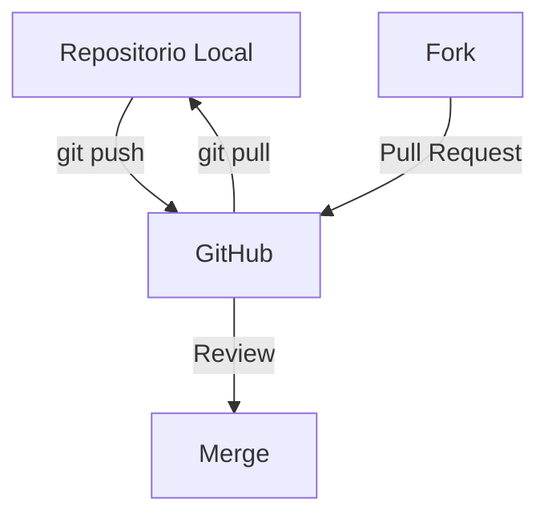

# 5. Trabajo con GitHub

En este documento se explica cómo interactuar con GitHub, desde conectar un repositorio local hasta colaborar mediante Pull Requests, Issues y otras herramientas avanzadas.

## 1. Conectar un Repositorio Local con GitHub

### 1.1. Crear un Repositorio en GitHub
- Ve a github.com/new.
- Ingresa un nombre, descripción y elige visibilidad (Public o Private).
- No inicialices con README.md si ya tienes un repositorio local.

### 1.2. Vincular el Repositorio Local (git remote add)
Ejecuta estos comandos en tu repositorio local:

```sh
git remote add origin https://github.com/usuario/repositorio.git  # HTTPS
git remote add origin git@github.com:usuario/repositorio.git     # SSH
```

Verificar conexión:

```sh
git remote -v  # Muestra las URLs configuradas
```

## 2. Subir y Bajar Cambios

### 2.1. git push – Subir Cambios a GitHub
Envía commits locales a la rama remota:

```sh
git push -u origin main  # Primera vez (establece upstream)
git push                 # Subidas posteriores
```

### 2.2. git pull – Descargar Cambios del Remoto
Combina git fetch + git merge para actualizar tu repositorio local:

```sh
git pull origin main
```

### 2.3. git fetch – Traer Cambios sin Fusionar
Descarga cambios del remoto pero no los aplica:

```sh
git fetch origin  # Trae cambios
git diff main origin/main  # Compara con la rama remota
```

## 3. Autenticación en GitHub

### 3.1. HTTPS vs SSH

| Método | Ventajas | Desventajas |
|---------|----------|-------------|
| HTTPS | Fácil de configurar. | Requiere token o credenciales cada vez. |
| SSH | No pide credenciales frecuentemente. | Configuración inicial más compleja. |

**Generar Clave SSH**

Ejecuta en tu terminal:

```sh
ssh-keygen -t ed25519 -C "tu@email.com"
```

Agrega la clave pública (`~/.ssh/id_ed25519.pub`) en GitHub SSH Keys.

### 3.2. Tokens de Acceso Personal (PAT)
Reemplazan contraseñas en HTTPS:

- Ve a Settings > Developer Settings > Personal Access Tokens.
- Crea un token con los permisos necesarios (ej: repo, admin:org).
- Úsalo en lugar de tu contraseña al hacer git push.

## 4. Forks y Pull Requests (PRs)

### 4.1. Fork – Copiar un Repositorio Ajeno
- Haz clic en Fork en el repositorio original (ej: github.com/original/repo).
- Clona tu fork localmente:

```sh
git clone https://github.com/tu-usuario/repo.git
```

### 4.2. Crear un Pull Request
1. Crea una rama para tus cambios:

```sh
git checkout -b mi-feature
```

2. Sube los cambios a tu fork:

```sh
git push origin mi-feature
```

3. En GitHub, ve a Pull Requests > New PR y selecciona:
   - **Base repository**: Original (original/repo).
   - **Head repository**: Tu fork (tu-usuario/repo:mi-feature).

### 4.3. Revisión de Código
- **Comentarios en líneas específicas**: Los revisores pueden sugerir cambios directamente en el PR.
- **Approvals**: Un mantenedor debe aprobar (Approve) antes de hacer merge.

## 5. Issues y Gestión de Tareas

### 5.1. Crear un Issue
- Ve a la pestaña Issues en el repositorio.
- Asigna etiquetas (bug, enhancement), hitos (milestones) y responsables.

### 5.2. Referenciar Issues en Commits
Cierra automáticamente un issue con palabras clave en el commit:

```sh
git commit -m "fix: corregir error en login. Close #123"
```

## 6. Herramientas Avanzadas de GitHub

### 6.1. GitHub Projects
Tablero Kanban para organizar tareas:
- Vincula Issues y PRs.
- Usa columnas como To Do, In Progress, Done.

### 6.2. GitHub Actions (CI/CD)
Automatiza pruebas, despliegues y más con workflows en `.github/workflows/`:

```yaml
name: Tests
on: [push]
jobs:
  test:
    runs-on: ubuntu-latest
    steps:
      - uses: actions/checkout@v4
      - run: npm install && npm test
```

### 6.3. Otras Herramientas
- **GitHub Pages**: Hosting para sitios web estáticos.
- **Codespaces**: Entorno de desarrollo en la nube.

## 7. Diagrama de Flujo GitHub



## 8. Resumen de Comandos

| Comando | Uso |
|---------|-----|
| `git remote add origin` | Vincula un repositorio local con GitHub. |
| `git push -u origin main` | Sube cambios y establece rama upstream. |
| `git pull` | Descarga y fusiona cambios. |
| `git fetch` | Trae cambios sin fusionar. |

## 9. Conclusión

- Usa `git remote add` para conectar tu repositorio local a GitHub.
- `git push` y `git pull` sincronizan cambios.
- Los PRs son clave para colaborar en proyectos abiertos.
- GitHub Actions y Projects optimizan flujos de trabajo.

**Siguiente**: 6. Ramas Avanzadas y Git Flow
