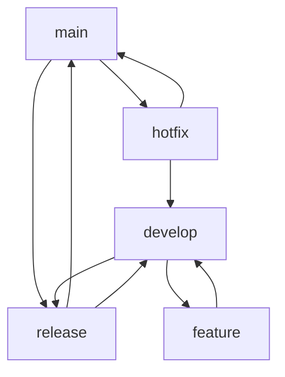

# 6. Ramas Avanzadas y Git Flow

En este documento se explican las estrategias avanzadas de ramificación, incluyendo Git Flow, GitHub Flow y otras metodologías para gestionar el desarrollo de software de manera eficiente y organizada.

## 1. Conceptos Fundamentales de Ramificación

### 1.1. ¿Por qué usar Ramas?
Las ramas permiten:
- Desarrollar funcionalidades en paralelo sin interferir con el código principal
- Mantener un historial limpio y organizado
- Facilitar la colaboración entre equipos
- Aislar experimentos y pruebas
- Implementar procesos de despliegue controlados

### 1.2. Tipos de Ramas Comunes
- **main/master**: Rama principal con código estable y desplegable
- **develop**: Rama de desarrollo donde se integran nuevas funcionalidades
- **feature**: Ramas para desarrollar funcionalidades específicas
- **release**: Ramas para preparar nuevas versiones
- **hotfix**: Ramas para correcciones urgentes en producción

## 2. Git Flow

### 2.1. ¿Qué es Git Flow?
Git Flow es una metodología de ramificación creada por Vincent Driessen que define un modelo estricto de ramificación diseñado alrededor del lanzamiento del proyecto.

### 2.2. Estructura de Ramas en Git Flow



### 2.3. Instalación de Git Flow
```sh
# Ubuntu/Debian
sudo apt-get install git-flow

# macOS
brew install git-flow-avh

# Windows (Git Bash)
curl -L -O https://raw.github.com/nvie/gitflow/develop/contrib/gitflow-installer.sh
bash gitflow-installer.sh
```

### 2.4. Inicialización de Git Flow
```sh
git flow init
```

Esto configurará automáticamente las ramas principales y las convenciones de nomenclatura.

## 3. Trabajando con Git Flow

### 3.1. Ramas Feature
**Crear una nueva funcionalidad:**
```sh
git flow feature start nueva-funcionalidad
```

**Trabajar en la funcionalidad:**
```sh
# Realizar commits normalmente
git add .
git commit -m "feat: implementar nueva funcionalidad"
```

**Finalizar la funcionalidad:**
```sh
git flow feature finish nueva-funcionalidad
```

**Publicar funcionalidad para colaboración:**
```sh
git flow feature publish nueva-funcionalidad
```

### 3.2. Ramas Release
**Crear una nueva versión:**
```sh
git flow release start 1.2.0
```

**Finalizar la versión:**
```sh
git flow release finish 1.2.0
```

Esto:
- Fusiona la rama release en main
- Crea un tag con la versión
- Fusiona los cambios de vuelta a develop
- Elimina la rama release

### 3.3. Ramas Hotfix
**Crear un hotfix:**
```sh
git flow hotfix start 1.2.1
```

**Finalizar el hotfix:**
```sh
git flow hotfix finish 1.2.1
```

## 4. GitHub Flow (Alternativa Simplificada)

### 4.1. Principios de GitHub Flow
GitHub Flow es más simple que Git Flow y se basa en:
- Solo existe una rama principal (main)
- Cualquier cambio se hace en ramas feature
- Las ramas feature se fusionan mediante Pull Requests
- Lo que está en main es desplegable

### 4.2. Flujo de Trabajo GitHub Flow
```sh
# 1. Crear rama feature
git checkout -b mi-nueva-funcionalidad

# 2. Desarrollar y hacer commits
git add .
git commit -m "feat: añadir nueva funcionalidad"

# 3. Subir rama
git push -u origin mi-nueva-funcionalidad

# 4. Crear Pull Request en GitHub
# 5. Revisar y aprobar
# 6. Fusionar a main
# 7. Eliminar rama feature
```

## 5. Estrategias Avanzadas de Merge

### 5.1. Tipos de Merge
```sh
# Merge normal (crea commit de merge)
git merge feature-branch

# Fast-forward merge (no crea commit de merge)
git merge --ff-only feature-branch

# Squash merge (combina todos los commits en uno)
git merge --squash feature-branch
```

### 5.2. Rebase vs Merge
**Rebase - Historial lineal:**
```sh
git checkout feature-branch
git rebase main
```

**Merge - Preserva historial:**
```sh
git checkout main
git merge feature-branch
```

### 5.3. Rebase Interactivo
```sh
git rebase -i HEAD~3  # Modifica los últimos 3 commits
```

Opciones disponibles:
- `pick`: Usar commit tal como está
- `reword`: Cambiar mensaje del commit
- `edit`: Pausar para editar el commit
- `squash`: Combinar con commit anterior
- `drop`: Eliminar commit

## 6. Gestión de Conflictos Avanzada

### 6.1. Herramientas para Resolver Conflictos
```sh
# Configurar herramienta de merge
git config --global merge.tool vimdiff

# Usar herramienta gráfica
git mergetool
```

### 6.2. Estrategias de Merge
```sh
# Favorecer versión actual
git merge -X ours feature-branch

# Favorecer versión entrante
git merge -X theirs feature-branch

# Estrategia recursiva (por defecto)
git merge -s recursive feature-branch
```

## 7. Automatización y Hooks

### 7.1. Git Hooks Útiles
**Pre-commit hook** (`.git/hooks/pre-commit`):
```sh
#!/bin/sh
# Ejecutar tests antes de commit
npm test
if [ $? -ne 0 ]; then
    echo "Tests fallaron. Commit cancelado."
    exit 1
fi
```

**Pre-push hook** (`.git/hooks/pre-push`):
```sh
#!/bin/sh
# Verificar que estamos en la rama correcta
branch=$(git rev-parse --abbrev-ref HEAD)
if [ "$branch" = "main" ]; then
    echo "No puedes hacer push directo a main"
    exit 1
fi
```

### 7.2. Herramientas de Automatización
```sh
# Husky para hooks de Node.js
npm install --save-dev husky

# Configurar hook
npx husky add .husky/pre-commit "npm test"
```

## 8. Mejores Prácticas

### 8.1. Nomenclatura de Ramas
```
feature/JIRA-123-nueva-funcionalidad
bugfix/JIRA-456-corregir-login
hotfix/1.2.1-seguridad-critica
release/2.0.0
```

### 8.2. Mensajes de Commit Semánticos
```
feat: añadir nueva funcionalidad de búsqueda
fix: corregir error en validación de formulario
docs: actualizar documentación de API
style: formatear código según estándares
refactor: reestructurar módulo de autenticación
test: añadir tests para componente principal
chore: actualizar dependencias
```

### 8.3. Configuración Recomendada
```sh
# Configuración global útil
git config --global pull.rebase true
git config --global rebase.autoStash true
git config --global branch.autosetupmerge always
git config --global branch.autosetuprebase always
```

## 9. Comparación de Estrategias

| Estrategia | Complejidad | Casos de Uso | Ventajas | Desventajas |
|------------|-------------|--------------|----------|-------------|
| **Git Flow** | Alta | Proyectos con releases programados | Muy organizado, ideal para equipos grandes | Complejo, puede ser excesivo para proyectos simples |
| **GitHub Flow** | Baja | Desarrollo continuo, despliegue frecuente | Simple, flexible | Menos estructura para proyectos complejos |
| **GitLab Flow** | Media | Balance entre estructura y simplicidad | Flexible con environments | Requiere disciplina del equipo |

## 10. Herramientas Complementarias

### 10.1. Visualización de Ramas
```sh
# Ver historial gráfico
git log --oneline --graph --all

# Alias útil
git config --global alias.tree "log --oneline --graph --all --decorate"
```

### 10.2. Limpieza de Ramas
```sh
# Eliminar ramas fusionadas localmente
git branch --merged | grep -v main | xargs git branch -d

# Eliminar referencias a ramas remotas eliminadas
git remote prune origin
```

## 11. Resumen de Comandos Git Flow

| Comando | Uso |
|---------|-----|
| `git flow init` | Inicializa Git Flow en el repositorio |
| `git flow feature start <nombre>` | Crea nueva rama feature |
| `git flow feature finish <nombre>` | Finaliza y fusiona feature |
| `git flow release start <version>` | Crea rama release |
| `git flow release finish <version>` | Finaliza release y crea tag |
| `git flow hotfix start <version>` | Crea rama hotfix |
| `git flow hotfix finish <version>` | Finaliza hotfix |

## 12. Conclusión

La elección de la estrategia de ramificación depende de varios factores: tamaño del equipo, frecuencia de releases, complejidad del proyecto y cultura organizacional. Git Flow es excelente para proyectos con releases planificados, mientras que GitHub Flow es ideal para desarrollo continuo y despliegue frecuente.

Las herramientas como rebase interactivo, hooks y automatización pueden mejorar significativamente la calidad y eficiencia del flujo de trabajo, independientemente de la estrategia elegida.

**Siguiente**: 7. Resolución de Problemas y Recuperación de Datos
